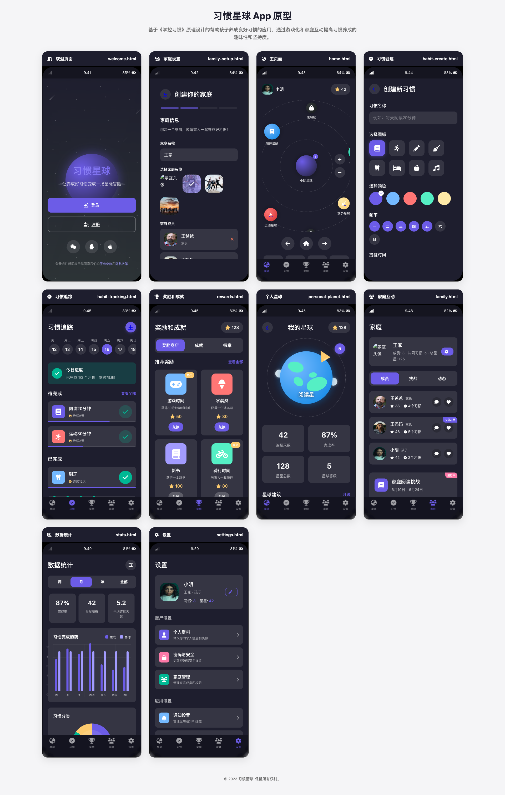

# Habit Planet - AI-Generated App Prototypes Comparison

这个项目展示了使用不同 AI IDE（Cursor 和 Trae）和不同大语言模型（Claude 3 Sonnet、OpenAI GPT-4o、DeepSeek-Coder 等）基于相同提示词生成的 "习惯星球" 应用原型。

## 项目背景

"习惯星球"（Habit Planet）是一个面向儿童的习惯养成应用原型，基于《掌控习惯》的理念设计。该应用通过游戏化的星际探索主题，帮助孩子们在家长引导下培养良好习惯。

## 项目结构

本项目包含多个由不同 AI 模型生成的原型实现：

| 文件夹 | AI IDE | 语言模型 | 说明 |
|--------|--------|---------|------|
| cursor-sonnet-3.5 | Cursor | Claude 3.5 Sonnet |  |
| cursor-sonnet-3.7-cn | Cursor | Claude 3.7 Sonnet | 中文界面 |
| cursor-sonnet-3.7-en | Cursor | Claude 3.7 Sonnet | 英文界面 |
| cusor-sonnet-3.7-thinking | Cursor | Claude 3.7 Sonnet | 带思考过程的生成 |
| cusor-openai-o4 | Cursor | OpenAI GPT-4o | GPT-4o 生成的原型 |
| trae-sonnet-3.7 | Trae | Claude 3.7 Sonnet | Trae IDE 下生成的原型 |
| trae-deepseek-r1 | Trae | DeepSeek-Coder | DeepSeek R1模型生成的原型 |
| trae-deepseek-v3 | Trae | DeepSeek-Coder V3 | DeepSeek V3模型生成的原型 |

## 如何浏览原型

每个文件夹下都有一个 `index.html` 文件，可以直接在浏览器中打开查看。每个原型展示了习惯星球应用的不同页面和功能（不同模型对应的功能页面不同），包括：

- 欢迎和引导页面
- 家庭设置
- 主页（星球探索）
- 习惯创建和追踪
- 奖励和成就系统
- 个人星球定制
- 家庭互动功能
- 数据统计
- 设置页面

## 比较分析

这些原型展示了不同 AI 模型和 IDE 在相同提示下产生的设计差异：

1. **界面风格**：不同模型对 UI 设计的理解和实现有明显差异
2. **功能侧重**：各模型对游戏化元素和习惯养成功能的平衡处理不同
3. **技术实现**：使用了不同的 CSS 框架（原生 CSS、Tailwind CSS 等）
4. **交互设计**：不同模型对用户体验和交互流程的设计思路各异
5. **中英文差异**：中英文提示词生成的界面在文案和风格上存在差异

## 使用说明

### 浏览原型
1. 克隆本仓库到本地
2. 使用浏览器打开任意文件夹中的 `index.html` 文件
3. 通过导航浏览不同页面和功能

### 生成截图
项目包含自动截图工具，可以为每个原型生成截图并更新到README：

1. 安装依赖：
   ```bash
   npm install
   ```

2. 生成截图：
   ```bash
   npm run serve-screenshot
   ```

3. 更新README添加截图：
   ```bash
   npm run update-readme
   ```

4. 或一键执行以上两步：
   ```bash
   npm run all
   ```

## 项目目的

本项目旨在展示不同 AI 代码生成模型在相同提示词下的能力差异，为研究人员和开发者提供参考，了解 AI 辅助开发工具在产品原型设计中的应用潜力和局限性。

## 界面截图

以下是各个AI模型生成的界面截图比较：

### Cursor + Claude 3.5 Sonnet


### Cursor + Claude 3.7 Sonnet (中文)



### Cursor + Claude 3.7 Sonnet (英文)


### Cursor + Claude 3.7 Sonnet Thinking


### Cursor + OpenAI GPT-4o


### Trae + Claude 3.7 Sonnet


### Trae + DeepSeek- R1


### Trae + DeepSeek-Coder V3


## 各模型特点对比


---

*注：此项目仅作为演示和研究用途，所有代码均由 AI 生成。* 